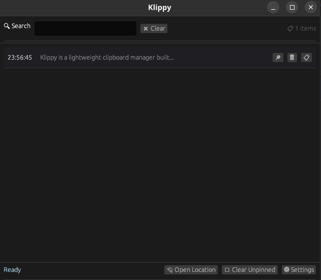

## Klippy

Klippy is a lightweight clipboard manager built with Rust and egui. This application allows users to store, search, and manage multiple clipboard entries efficiently.

<p align="start">
    
</p>

Klippy can:

- Automatically captures and stores clipboard content
- Search through clipboard history
- Pin important entries to prevent automatic removal
- Customizable settings

### Installation

#### From crates.io

```bash
cargo install klippy
```

#### From source

1. Clone

```bash
git clone https://github.com/ThembinkosiThemba/klippy.git
cd klippy
```

2. Build and run:

```bash
cargo build --release
cargo run --release
```

3. The compiled binary will be available at `target/release/klippy`

### Usage

- The application runs in the background and automatically stores text copied to your clipboard
- Click on any entry to copy it back to your clipboard
- Use the search box to find specific entries
- Pin important entries with the 📍 button to prevent them from being automatically removed

### Settings

- Set maximum number of entries to keep
- Access via the "Settings" button

### Storage Location

The application stores your clipboard data at:

- **Linux**: `~/.config/klippy/klippy/data.json`
- **Windows**: `%APPDATA%\klippy\klippy\config\data.json`
- **macOS**: `~/Library/Application Support/com.klippy.klippy/config/data.json`

You can open this location directly using the "Open Storage" button.

## License

## License

MIT License - see [LICENSE](/LICENSE) file for details
